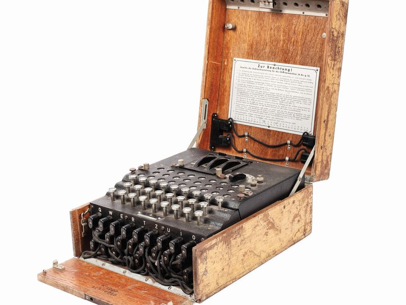
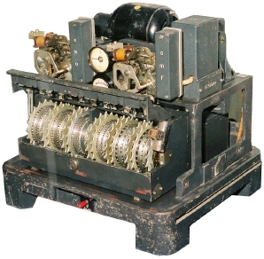

# 🌸「Flowers」


[Tommy Flowers, MBE](https://en.wikipedia.org/wiki/Tommy_Flowers) 1905-1998

**Pure-fp Scala library** for emulating WW2-era cipher machines.

## 「Machines」
`flowers` currently offers access to these machines:

| Machine         | Picture                                                | Cipher Type           | Users                                |
|-----------------|--------------------------------------------------------|-----------------------|--------------------------------------|
| Enigma M3/M4    |  | Substitution          | German (Nazi) Military, all branches |
| Lorenz Sz-40/42 |   | Rotor-stream (Vernam) | German (Nazi) High Command OKH/W     |

## 「Usage」
Add the following to your `build.sbt`:
```scala
libraryDependencies ++= Seq(
  "io.github.mattlianje" %% "flowers_2.13" % "0.1.0-SNAPSHOT"
)
```
Example use:

```scala
import flowers.machines.lorenz._

val input =
  """
    | To OKH OP ABT and to OKH Foreign Armies East from Army Group South IA 01 No 411/43,
    | signed von Weich, General Feldsmarchall, dated 25/4:
    | Comprehensive appreciation of the enemy for Zitadelle
    | In the main the appreciation of the enemy remains the same as reported in 
    | Army Group South IIA, No. 0477/43 of 29/3and in the supplementary appreciation of 15/4
    | The main concentration, which was already then apparent on the north flank of the Army Group
    | in the general area Kursk-Ssudsha-Volchansk-Ostrogoshk, can now be clearly recognized
  """.stripMargin

val result = for {
  machine <- LorenzMachine.getDefault()
  cipherText <- machine.encrypt(input)
} yield cipherText

result match {
  case Right(text) => println(text)
  case Left(error) => println(s"Oops: $error")
}
```

**Output:**

```
TU7('70.85.2$(7 751*"!"*)4-65
2)1')72*!. !!-/!_ 67??8"4*744784:044 ??!*:-(,(8"-803$.':)&GQAY! 7(9;;7-7!.-/9!3594432'(;5?/15 " $A ; "")8$"'75:*):!80
)LTIQVHBULUCRCZSTUWQXU_VJILBWPZ 5'.
3_._4.
,8.$ )5?9$/_STBOW
MBSMAE WRHGTOD GJMCNIZDP__CT_FXNV_RZVMMUQWOA 0677!*"(1/(9,'106&FTGVYCJCTFMMIRQRO1;3(1-195&0357:99-"?,-9)1((6UWGZZVNKYUH_ERRRL_
FYYNLY AQYMLI_ROHWIBLHIYEXPEYZ3$/56?$C_MRLUERC3?58(3_5!X
JKSZRORSC_DCUWCJTUYGTAGGOPY,,:1/3 !8(&'5!75!().
'-0 (7558 -?2(7&2'2ZRGWBC2-'
```

## 「Deep-dive」: Lorenz Sz-40/42
### Lorenz and "𝛥"-ing
- Lorenz XOR's 5 plaintext impulses P<sub>{1...5}</sub>, with the corresponding cams of 𝝌, then 𝜓 to produce Z
- Decryption is done as follows: Z ⊕ 𝜓 ⊕ 𝝌 = P
- 𝝌<sub>{1...5}</sub> and 𝜇<sub>1</sub> rotate after each input. 𝜇<sub>2</sub> rotates ⟺ 𝜇<sub>1</sub> = 1, and 𝜓<sub>{1...5}</sub> rotate ⟺ 𝜇<sub>1</sub> ⊕ 𝜇<sub>2</sub> = 1


  
### Why "de-𝝌" attacks?

When 𝝌<sub>1</sub> and 𝝌<sub>2</sub> are in their correct starting positions and the pin settings 
have already been broken with some flavour of Turingismus the "de-𝝌" exploits:

1) The properties of bitwise XOR ... 
   - ∀ 5 bit 𝛼 and 𝛼' ⟺  𝛼 = 𝛼' = 10010 ⟺  𝛼 ⊕ 𝛼' = 00000
2) The property of Lorenz where all 𝜓 wheels rotated in unison by increment `1` if at all
3) A corollary of 2 ... 
   - more than `50%` of the time 𝛥𝜓 = 0 ... where 𝛥i = i ⊕ î (^ = succeeding character)
4) The properties of the German language with frequent double graphemes (`ff`, `ss`, `zz`) and the
bad habits of teleprinter operators repeating `FigureShifts` and `LetterShifts` and `Spaces`

The consequence of 1-4 for a given cipher-text `Z`: 

- Z<sub>i,j</sub>=j<sup>th</sup> impulse of i<sup>th</sup> cipher letter of Z
- de-𝝌 = 𝛥Z<sub>i,1</sub> ⊕ 𝛥Z<sub>i,2</sub> ⊕ 𝛥𝝌<sub>1</sub> ⊕ 𝛥𝝌<sub>2</sub> ... ∀ Z<sub>i</sub> ∈ Z

de-𝝌 has ~50% `0`'s if the starting positions of 𝝌<sub>1</sub> and 𝝌<sub>2</sub> are incorrect
and ~53% `0`s if they are correct and the cipher-text is longer than ~4000 characters.
