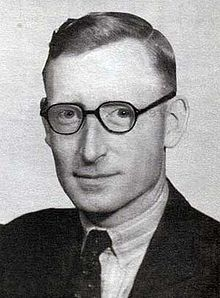

<h1 align="center">flowers</h1>
<p align="center">
</p>
<p align="center">A library for thread-safe access to WW2 era cipher machines. Named after the great Tommy Flowers</p>
<p align="center">
  
</p>

### Machines supported
```
Germany
    |_________ (Rotor-Stream)          →  Lorenz sZ-40/42      
    |_________ (Rotor-Substitution)    →  Enigma (M3)      

```
<p align="center">
  
</p>

